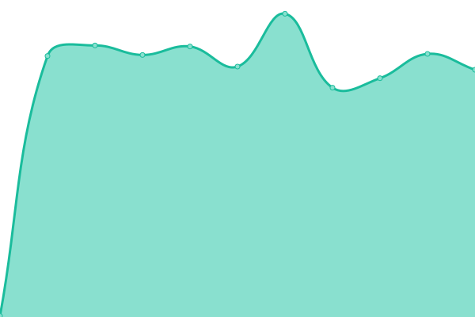
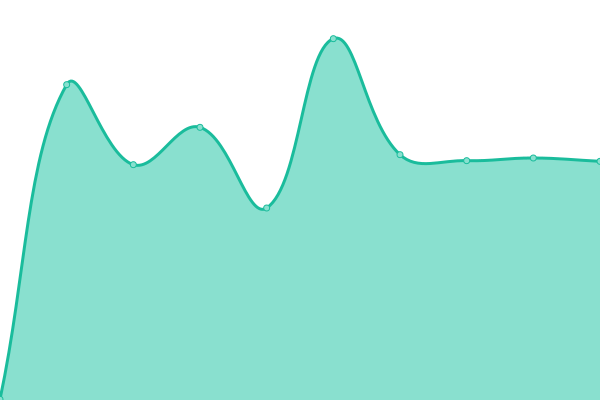

# [📈 Live Status](https://ISAIC-ca.github.io/uptime-status): <!--live status--> **🟩 All systems operational**

This repository contains the open-source uptime monitor and status page for [ISAIC-ca](https://ISAIC-ca.github.io/uptime-status), powered by [Upptime](https://github.com/upptime/upptime).

With [Upptime](https://upptime.js.org), you can get your own unlimited and free uptime monitor and status page, powered entirely by a GitHub repository. We use [Issues](https://github.com/ISAIC-ca/uptime-status/issues) as incident reports, [Actions](https://github.com/ISAIC-ca/uptime-status/actions) as uptime monitors, and [Pages](https://ISAIC-ca.github.io/uptime-status) for the status page.

<!--start: status pages-->
<!-- This summary is generated by Upptime (https://github.com/upptime/upptime) -->
<!-- Do not edit this manually, your changes will be overwritten -->
<!-- prettier-ignore -->
| URL | Status | History | Response Time | Uptime |
| --- | ------ | ------- | ------------- | ------ |
|  [VMondemand](https://vmod.isaic.ca/app/authentication/sign-in) | 🟩 Up | [v-mondemand.yml](https://github.com/ISAIC-ca/uptime-status/commits/HEAD/history/v-mondemand.yml) | 

 246ms
     
 | 

<a href="https://ISAIC-ca.github.io/uptime-status/history/v-mondemand">99.83%</a>
    

|  [ISAIC Website](https://isaic.ca) | 🟩 Up | [isaic-website.yml](https://github.com/ISAIC-ca/uptime-status/commits/HEAD/history/isaic-website.yml) | 

 982ms
     
 | 

<a href="https://ISAIC-ca.github.io/uptime-status/history/isaic-website">100.00%</a>
    

|  [Openstack Infrastructure](https://aihubdb.ece.ualberta.ca/auth/login/?next=/) | 🟩 Up | [openstack-infrastructure.yml](https://github.com/ISAIC-ca/uptime-status/commits/HEAD/history/openstack-infrastructure.yml) | 

 394ms
     
 | 

<a href="https://ISAIC-ca.github.io/uptime-status/history/openstack-infrastructure">100.00%</a>
    

<!--end: status pages-->

[**Visit our status website →**](https://ISAIC-ca.github.io/uptime-status)

## 📄 License

- Powered by: [Upptime](https://github.com/upptime/upptime)
- Code: [MIT](./LICENSE) © [Anand Chowdhary](https://anandchowdhary.com), supported by [Pabio](https://pabio.com)
- Data in the `./history` directory: [Open Database License](https://opendatacommons.org/licenses/odbl/1-0/)
